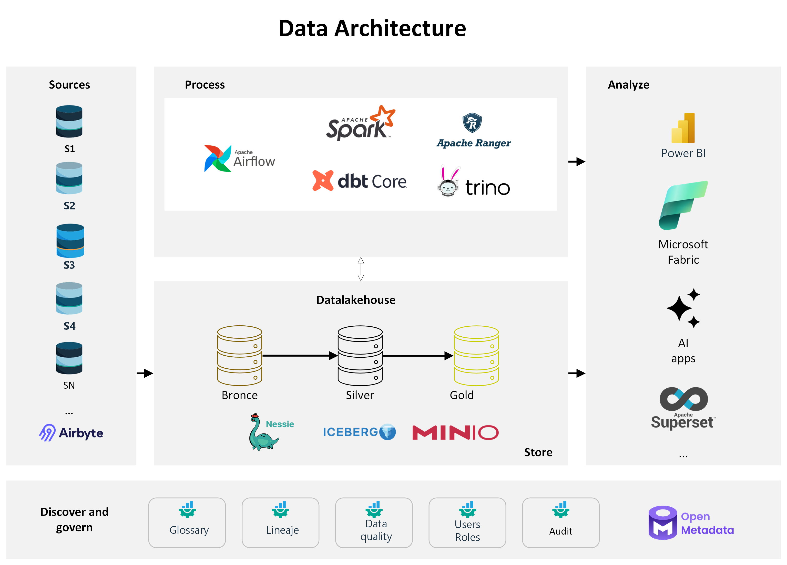

# CEDIA Data Lakehouse Architecture

---

This repository contains the infrastructure-as-code for deploying a modern data lakehouse stack using Docker. It provides a scalable and version-controlled environment for data ingestion, storage, transformation, and querying.

## 🏛️ Core Architecture



This project implements a robust data architecture based on the following open-source tools:

-   **[MinIO](https://min.io/):** S3-compatible object storage for the data lake.
-   **[Project Nessie](https://projectnessie.org/):** A transactional catalog for the data lake that provides Git-like semantics (branches, tags, commits) for data.
-   **[Trino](https://trino.io/):** A distributed SQL query engine for high-performance queries on the data lake.
-   **[Airbyte](https://airbyte.com/):** A data integration platform for ingesting data from various sources into the bronze layer of the data lake.
-   **[dbt (data build tool)](https://www.getdbt.com/):** A transformation tool for building, testing, and deploying data models in the silver and gold layers.

For a detailed explanation of the architecture, design principles, and best practices, please see the **[Data Engineering Best Practices Guide](./practicas_recomendadas.md)**.

## Data Flow Overview

The pipeline processes data in the following sequence:

1.  **Airbyte**: Ingests data from a MariaDB source and lands it in an S3/Iceberg table (Bronze layer).
2.  **Trino + Nessie**: Provides the query engine and data cataloging capabilities.
3.  **dbt**: Executes SQL transformations to clean, standardize, and aggregate the data.
    -   **Silver Layer**: Cleans and standardizes the raw data (`stg_proforma`).
    -   **Gold Layer**: Creates aggregated tables for BI and analytics (`fct_proforma`).
4.  **Trino/BI Tools**: End users can query the Gold layer tables for analysis.

```
Airbyte (MariaDB → S3 minio/Iceberg: Bronze)
       │
       ▼
Trino + Nessie (Catalog: iceberg_dev / iceberg_prod)
       │
       ▼
dbt (SQL + Jinja Transformations)
   ├─ Silver: stg_proforma      ← Cleans, standardizes, and applies CDC logic
   └─ Gold  : fct_proforma      ← Aggregates metrics for BI consumption
       │
       ▼
BI & Analytics Tools (Queries via Trino)
```

## 🚀 Getting Started

Follow these steps to set up and run the entire data stack locally.

### Prerequisites

-   [Docker](https://docs.docker.com/get-docker/) and [Docker Compose](https://docs.docker.com/compose/install/) installed.
-   A command-line terminal (bash, PowerShell, etc.).

### 1. Create the Docker Network

All services will communicate over a dedicated Docker network.

```bash
docker network create data-poc
```

### 2. Launch Core Infrastructure

This command will start MinIO, Nessie, and Trino in detached mode.

```bash
docker compose -p cedia \
  -f .\/minio-docker-compose.yml \
  -f .\/nessie-docker-compose.yml \
  -f .\/trino\/trino-docker-compose.yml \
  up -d
```

### 3. Install and Configure Airbyte

Follow the [official Airbyte OSS Quickstart](https://docs.airbyte.com/platform/using-airbyte/getting-started/oss-quickstart) to install Airbyte.

After installation, you must connect the Airbyte containers to our shared Docker network so they can communicate with Nessie and MinIO.

```bash
docker network connect data-poc 68a10ca66d3f
# Add other airbyte containers if necessary
```
Remplazar 68a10ca66d3f por el id del contenedor general de Airbyte

#### Check
```bash
docker ps --filter "network=data-poc"
# or
docker network inspect data-poc
```

### 4. Create Nessie Branches

Create branches in Nessie to isolate the `dev`, `stg`, and `prod` environments.

```bash
# Create dev, stg, and prod branches from main
docker run --rm --network data-poc ghcr.io/projectnessie/nessie-cli:latest --uri http://nessie:19120/api/v2 --non-ansi -c "CREATE BRANCH dev FROM main"
docker run --rm --network data-poc ghcr.io/projectnessie/nessie-cli:latest --uri http://nessie:19120/api/v2 --non-ansi -c "CREATE BRANCH stg FROM main"
docker run --rm --network data-poc ghcr.io/projectnessie/nessie-cli:latest --uri http://nessie:19120/api/v2 --non-ansi -c "CREATE BRANCH prod FROM main"

# Verify the branches
docker run --rm --network data-poc ghcr.io/projectnessie/nessie-cli:latest --uri http://nessie:19120/api/v2 --non-ansi -c "LIST REFERENCES;"
```

### 5. Create Trino Schemas

Connect to the Trino CLI to define the schemas (namespaces) for our data layers. The `LOCATION` property is critical as it points to the correct directory in our MinIO buckets.

```bash
# Connect to the Trino CLI
docker exec -it trino trino
```

Once inside the Trino CLI, run the SQL commands to create the schemas. For a complete list of schemas, see the **[Trino Schemas Guide](./trino/schemas.md)**.

Example:
```sql
-- In the Trino CLI
CREATE SCHEMA IF NOT EXISTS iceberg_dev.cedia_bronze_sia
  WITH (location='s3a://cedia-datalake-dev/iceberg/bronze/sia/');
```

## 🛠️ Usage

### Connecting to Trino

You can connect to Trino using any compatible SQL client, such as DBeaver or DataGrip.

-   **Host:** `localhost`
-   **Port:** `8080`
-   **User:** Any username (e.g., `admin`)
-   **Password:** Leave blank

After connecting, verify that you can see the Iceberg catalogs:

```sql
SHOW CATALOGS;
-- Expected result includes iceberg_dev and iceberg_prod
```

### Running dbt Transformations

The `dbt` folder is set up to run transformations against the data lake.

```bash
# Build the dbt container image
docker compose -p cedia -f .\dbt\docker-compose.yml build dbt

# Run a dbt build for the 'dev' target
# This will run all models and tests
docker compose -p cedia -f .\dbt\docker-compose.yml run --rm dbt dbt build --target dev

# Run only specific models
docker compose -p cedia -f .\dbt\docker-compose.yml run --rm dbt dbt build --target dev --select stg_proforma fct_proforma

# Test the connection to the warehouse
docker compose -p cedia -f .\dbt\docker-compose.yml run --rm dbt dbt debug --target dev
```

## 📂 Project Structure

```
.
├── .github/                # CI/CD workflows
├── dbt/                    # dbt project for data transformations
│   ├── models/             # dbt models (silver, gold layers)
│   └── dbt_project.yml     # dbt project configuration
├── trino/                  # Trino configuration
│   ├── catalog/            # Catalog properties files (iceberg_dev, iceberg_prod)
│   └── schemas.md          # Guide for creating Trino schemas
├── minio-docker-compose.yml  # Docker Compose for MinIO
├── nessie-docker-compose.yml # Docker Compose for Nessie
├── practicas_recomendadas.md # Detailed architecture and best practices guide
└── README.md               # This file
```

## CI/CD

This project integrates CI/CD practices to ensure code quality and smooth deployments. Workflow configurations can be found in the `.github/` directory.

## Contributing

Contributions are welcome! Please refer to our contributing guidelines for details on submitting bug fixes, enhancements, or new features. For any inquiries, please contact the department below.

## License

This project is licensed under the MIT License. See the LICENSE file for details.

**Department:** Sistemas Internos

**Maintainer:** [Felipe Mendieta - CEDIA](mailto:felipe.mendieta@cedia.org.ec)

## Disclaimer
This project does not contain sensitive data; it is used only for testing deployment purposes.

