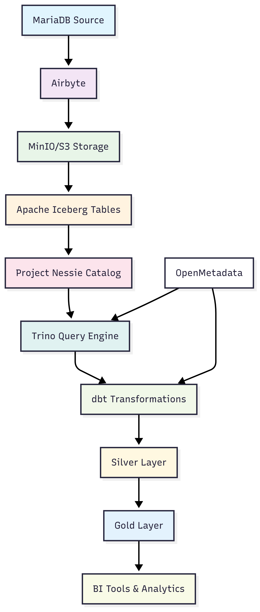
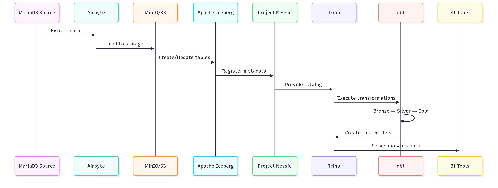

# 🏗️ CEDIA Data Lakehouse - dbt Pipeline

> **A modern data lakehouse implementation using dbt, Trino, Apache Iceberg, and Project Nessie for scalable data processing and analytics.**

This repository contains a comprehensive data pipeline that follows the **Medallion Architecture** (Bronze → Silver → Gold) to process and transform data from source systems into business-ready analytics models. The pipeline leverages cutting-edge technologies to provide a robust, scalable, and maintainable data infrastructure.

## 📋 Table of Contents

- [🏗️ CEDIA Data Lakehouse - dbt Pipeline](#️-cedia-data-lakehouse---dbt-pipeline)
  - [📋 Table of Contents](#-table-of-contents)
  - [🎯 Overview](#-overview)
  - [🏛️ Architecture](#️-architecture)
  - [🔧 Technology Stack](#-technology-stack)
  - [📚 Terminology & Key Concepts](#-terminology--key-concepts)
  - [🔄 Data Flow](#-data-flow)
  - [📊 Data Layers (Medallion Architecture)](#-data-layers-medallion-architecture)
  - [🗂️ Project Structure](#️-project-structure)
  - [⚙️ Configuration](#️-configuration)
  - [🚀 Getting Started](#-getting-started)
  - [🧪 Testing & Validation](#-testing--validation)
  - [📖 Documentation](#-documentation)
  - [🐛 Troubleshooting](#-troubleshooting)
  - [🔄 Development Workflow](#-development-workflow)
  - [📚 Additional Resources](#-additional-resources)

## 🎯 Overview

The CEDIA Data Lakehouse is a modern data platform that processes and transforms data through multiple layers to provide clean, reliable, and business-ready datasets for analytics and reporting. This pipeline demonstrates best practices in data engineering using open-source technologies.

### Key Features

- ✅ **Medallion Architecture**: Bronze → Silver → Gold data layers
- ✅ **Change Data Capture (CDC)**: Incremental processing for efficiency
- ✅ **Data Versioning**: Git-like versioning with Project Nessie
- ✅ **ACID Transactions**: Apache Iceberg for reliable data operations
- ✅ **SQL Interface**: Trino for unified querying across data sources
- ✅ **Data Lineage**: Complete traceability from source to consumption

## 🏛️ Architecture



## 🔧 Technology Stack

| Component | Technology | Purpose |
|-----------|------------|---------|
| **Data Ingestion** | Airbyte | Extract and load data from source systems |
| **Storage** | MinIO/S3 + Apache Iceberg | Scalable object storage with table format |
| **Catalog** | Project Nessie | Data versioning and catalog management |
| **Query Engine** | Trino | Distributed SQL query engine |
| **Transformations** | dbt Core + dbt-trino | Data modeling and transformation |
| **Data Governance** | OpenMetadata | Metadata management and lineage |
| **Containerization** | Docker + Docker Compose | Environment consistency |

## 📚 Terminology & Key Concepts

### Core Technologies

#### 🚀 **Airbyte**
- **What it is**: An open-source data integration platform
- **Purpose**: Extracts data from various sources (databases, APIs, files) and loads it into destinations
- **In this project**: Connects MariaDB to Iceberg tables on MinIO/S3
- **Benefits**: No-code/low-code setup, extensive connector library, real-time and batch processing

#### 🧊 **Apache Iceberg**
- **What it is**: An open table format for large analytic datasets
- **Purpose**: Provides ACID transactions, schema evolution, and time travel capabilities
- **In this project**: Stores data in a format optimized for analytics workloads
- **Benefits**: Better performance, reliability, and data governance compared to traditional formats

#### 🦆 **Project Nessie**
- **What it is**: A transactional catalog for data lakes with Git-like semantics
- **Purpose**: Manages data versions, branches, and merges in data lakes
- **In this project**: Provides versioning for Iceberg tables and schemas
- **Benefits**: Enables data versioning, rollback capabilities, and collaborative data development

#### ⚡ **Trino**
- **What it is**: A distributed SQL query engine designed for analytical workloads
- **Purpose**: Enables querying data across multiple sources with a single SQL interface
- **In this project**: Serves as the query engine for all data operations
- **Benefits**: High performance, federated queries, and ANSI SQL compliance

#### 🔄 **dbt (data build tool)**
- **What it is**: A transformation workflow tool that enables analytics engineers to transform data using SQL
- **Purpose**: Manages data transformations, testing, and documentation
- **In this project**: Handles all data modeling and transformation logic
- **Benefits**: Version control for data transformations, automated testing, and documentation

#### 📊 **OpenMetadata**
- **What it is**: An open-source metadata management platform
- **Purpose**: Provides data discovery, lineage, and governance capabilities
- **In this project**: Tracks data lineage and provides metadata catalog
- **Benefits**: Data discovery, impact analysis, and compliance tracking

### Data Architecture Concepts

#### 🏅 **Medallion Architecture**
A data architecture pattern that organizes data into three layers:
- **Bronze**: Raw, unprocessed data as it arrives from source systems
- **Silver**: Cleaned, validated, and enriched data ready for analysis
- **Gold**: Business-ready, aggregated data optimized for specific use cases

#### 🔄 **Change Data Capture (CDC)**
A technique to identify and capture changes made to data in a database, then deliver those changes in real-time to downstream systems.

#### 📈 **Data Lineage**
The tracking of data from its origin through various transformations to its final destination, providing transparency and traceability.

## 🔄 Data Flow

The pipeline processes data through the following sequence:




### Processing Steps

1. **📥 Data Ingestion**: Airbyte extracts data from MariaDB and loads it into Iceberg tables on MinIO/S3
2. **📊 Data Cataloging**: Project Nessie manages table metadata and versioning
3. **🔄 Data Transformation**: dbt processes data through Bronze → Silver → Gold layers
4. **📈 Data Consumption**: BI tools query the final Gold layer tables via Trino

## 📊 Data Layers (Medallion Architecture)

### 🥉 Bronze Layer
**Purpose**: Raw data ingestion and storage

- **Description**: Data is stored exactly as it arrives from source systems
- **Characteristics**: 
  - Unprocessed and unvalidated
  - Preserves original data structure
  - Enables data recovery and reprocessing
- **Location**: `iceberg_dev.cedia_bronze_sia.jvc_proforma`
- **Naming Convention**: `{source}_{table_name}`

### 🥈 Silver Layer  
**Purpose**: Cleaned, validated, and standardized data

- **Description**: Data is cleaned, typed, and standardized for reuse
- **Characteristics**:
  - Data quality checks applied
  - Consistent naming conventions
  - Optimized for downstream processing
- **Tables**: `stg_*` (staging models)
- **Location**: `iceberg_dev.cedia_silver_sia`
- **Example**: `stg_sia__proforma`

### 🥇 Gold Layer
**Purpose**: Business-ready, aggregated data for analytics

- **Description**: Data is aggregated and optimized for specific business use cases
- **Characteristics**:
  - Business logic applied
  - Optimized for query performance
  - Ready for BI consumption
- **Tables**: `fct_*` (facts), `dim_*` (dimensions)
- **Location**: `iceberg_dev.cedia_gold_sia`
- **Example**: `fct_sia__proforma`

## 🗂️ Project Structure

```
dbt_lakehouse_cedia/
├── 📄 Dockerfile              # Docker image definition for dbt
├── 🐳 docker-compose.yml      # Compose service for dbt
├── 📦 requirements.txt        # Python dependencies (dbt-trino, utils, etc.)
├── ⚙️ dbt_project.yml         # Main dbt project configuration
├── 📚 packages.yml            # dbt package dependencies
├── 🔗 profiles/               # Connection profiles (Trino)
│   └── profiles.yml
├── 🛠️ macros/                 # Custom macros (Iceberg schema creation, etc.)
│   ├── create_iceberg_schema.sql
│   └── generate_schema_name.sql
├── 📊 models/                 # Data models organized by layer
│   ├── 🥉 bronze/             # Raw sources (Airbyte ingestion)
│   │   └── sia_sources.yml
│   ├── 🥈 silver/             # Staging/cleaned models
│   │   └── sia/
│   │       ├── schema.yml
│   │       └── stg_sia__proforma.sql
│   └── 🥇 gold/               # Business-ready models
│       └── sia/
│           ├── schema.yml
│           └── fct_sia__proforma.sql
└── 📋 sources/                # Source definitions
    └── sia_sources.yml
```

### Key Files Explained

| File | Purpose | Description |
|------|---------|-------------|
| `dbt_project.yml` | Project configuration | Defines project settings, models, and macros |
| `packages.yml` | Package dependencies | Lists external dbt packages used in the project |
| `profiles/profiles.yml` | Database connections | Contains Trino connection configurations |
| `macros/` | Reusable SQL code | Custom Jinja macros for common operations |
| `models/bronze/` | Raw data sources | References to tables created by Airbyte |
| `models/silver/` | Staging models | Cleaned and standardized data transformations |
| `models/gold/` | Business models | Aggregated data ready for analytics |

## ⚙️ Configuration

### Environment Variables

The project uses environment variables for configuration. Create a `.env` file in the root project directory:

```bash
# Copy the example file
cp ../.env.example ../.env
```

### Required Environment Variables

```bash
# Trino Connection
TRINO_HOST=trino
TRINO_PORT=8083
TRINO_USER=dbt
TRINO_CATALOG=iceberg_dev
DBT_DEFAULT_SCHEMA=dbt_dev

# OpenMetadata Integration
OPENMETADATA_HOST=http://openmetadata-server:8585/api
OPENMETADATA_SERVICE=trino_iceberg_dev
OPENMETADATA_JWT=your-token-here

# Nessie Configuration
NESSIE_URI=http://nessie:19120/api/v1
```

> ⚠️ **Important**: The `.env` file must be placed in the root project folder (`data_architecture/.env`), not inside `dbt_lakehouse_cedia/`.

### dbt Project Configuration

The `dbt_project.yml` file contains the main project configuration:

```yaml
name: 'dbt_lakehouse_cedia'
version: '1.0.0'
config-version: 2

profile: 'cedia_trino'

model-paths: ["models"]
analysis-paths: ["analysis"]
test-paths: ["tests"]
seed-paths: ["seeds"]
macro-paths: ["macros"]
snapshot-paths: ["snapshots"]

target-path: "target"
clean-targets:
  - "target"
  - "dbt_packages"

models:
  dbt_lakehouse_cedia:
    bronze:
      +materialized: table
    silver:
      +materialized: table
    gold:
      +materialized: table
```

## 🚀 Getting Started

### Prerequisites

Before running the pipeline, ensure you have:

- ✅ Docker and Docker Compose installed
- ✅ Access to the source MariaDB database
- ✅ All required services running (Trino, Nessie, MinIO, OpenMetadata)
- ✅ Environment variables configured

### Quick Start

1. **Build the dbt Docker image**:
   ```bash
   docker compose -p cedia -f ./dbt_lakehouse_cedia/docker-compose.yml build dbt
   ```

2. **Test the connection**:
   ```bash
   docker compose -p cedia -f ./dbt_lakehouse_cedia/docker-compose.yml run --rm -e TRINO_PORT=8080 dbt dbt debug --target dev

   docker compose -p cedia -f ./dbt_lakehouse_cedia/docker-compose.yml run --rm -e TRINO_PORT=8080 dbt dbt debug --profiles-dir profiles
   ```

3. **Install or update dbt packages**:
   ```bash
   docker compose -p cedia -f ./dbt_lakehouse_cedia/docker-compose.yml run --rm -e TRINO_PORT=8080 dbt dbt deps
   ```

4. **Run the complete pipeline**:
   ```bash
   docker compose -p cedia -f ./dbt_lakehouse_cedia/docker-compose.yml run --rm -e TRINO_PORT=8080 dbt dbt build --target dev
   ```

### Common dbt Commands

| Command | Purpose | Example |
|---------|---------|---------|
| `dbt debug` | Test database connection | `dbt debug --target dev` |
| `dbt run` | Execute all models | `dbt run --target dev` |
| `dbt build` | Run models and tests | `dbt build --target dev` |
| `dbt test` | Run data quality tests | `dbt test --target dev` |
| `dbt docs generate` | Generate documentation | `dbt docs generate --target dev` |
| `dbt docs serve` | Serve documentation locally | `dbt docs serve` |

### Selective Model Execution

Run specific models or layers:

```bash
# Run only staging models
docker compose -p cedia -f ./dbt_lakehouse_cedia/docker-compose.yml run --rm dbt dbt run --target dev --select stg_sia__proforma

# Run staging and fact models
docker compose -p cedia -f ./dbt_lakehouse_cedia/docker-compose.yml run --rm dbt dbt run --target dev --select stg_sia__proforma fct_sia__proforma

# Run all models in a specific layer
docker compose -p cedia -f ./dbt_lakehouse_cedia/docker-compose.yml run --rm dbt dbt run --target dev --select silver
```

## 🧪 Testing & Validation

### Data Quality Tests

The project includes comprehensive data quality tests defined in `schema.yml` files:

```yaml
version: 2

models:
  - name: stg_sia__proforma
    description: "Staging model for SIA proforma data"
    columns:
      - name: id
        description: "Primary key"
        tests:
          - not_null
          - unique
      - name: amount
        description: "Transaction amount"
        tests:
          - not_null
          - dbt_utils.accepted_range:
              min_value: 0
              max_value: 1000000
```

### Running Tests

```bash
# Run all tests
docker compose -p cedia -f ./dbt_lakehouse_cedia/docker-compose.yml run --rm dbt dbt test --target dev

# Run tests for specific models
docker compose -p cedia -f ./dbt_lakehouse_cedia/docker-compose.yml run --rm dbt dbt test --select stg_sia__proforma

# Run tests with build (models + tests)
docker compose -p cedia -f ./dbt_lakehouse_cedia/docker-compose.yml run --rm dbt dbt build --target dev
```

### Test Types

| Test Type | Purpose | Example |
|-----------|---------|---------|
| `not_null` | Ensures column has no null values | Primary keys, required fields |
| `unique` | Ensures column values are unique | Primary keys, business keys |
| `accepted_values` | Validates against allowed values | Status fields, categories |
| `relationships` | Ensures referential integrity | Foreign key relationships |
| `dbt_utils.accepted_range` | Validates numeric ranges | Amounts, quantities |

## 📖 Documentation

### Generate dbt Documentation

```bash
# Generate documentation
docker compose -p cedia -f ./dbt_lakehouse_cedia/docker-compose.yml run --rm dbt dbt docs generate --target dev

# Serve documentation locally
docker compose -p cedia -f ./dbt_lakehouse_cedia/docker-compose.yml run --rm -p 8080:8080 dbt dbt docs serve
```

Then open: **http://localhost:8080**

### Documentation Features

- 📊 **Data Lineage**: Visual representation of data flow
- 📝 **Model Descriptions**: Detailed documentation for each model
- 🧪 **Test Results**: Data quality test outcomes
- 📈 **Column Details**: Data types, descriptions, and constraints
- 🔍 **Source Documentation**: Information about source tables

## 🐛 Troubleshooting

### Common Issues and Solutions

#### Connection Issues

**Problem**: `dbt debug` fails with connection errors

**Solutions**:
```bash
# Check environment variables
docker compose run --rm dbt env | grep TRINO

# Verify Docker network connectivity
docker network ls
docker network inspect data-poc
```

#### Missing Source Tables

**Problem**: Model fails due to missing source table

**Solutions**:
- Verify Airbyte has created the raw table: `iceberg_dev.db_sia_intranet.jvc_proforma`
- Check source definitions in `sources/sia_sources.yml`
- Ensure proper schema permissions

#### OpenMetadata Integration Issues

**Problem**: Lineage not visible in OpenMetadata

**Solutions**:
- Verify `OPENMETADATA_JWT` is valid and not expired
- Check ingestion workflows are running
- Confirm service configuration matches

#### Performance Issues

**Problem**: Slow model execution

**Solutions**:
- Check Trino cluster resources
- Optimize SQL queries in models
- Consider partitioning strategies for large tables

### Debug Commands

```bash
# Check dbt connection
docker compose run --rm dbt dbt debug --target dev

# View dbt logs
docker compose run --rm dbt dbt run --target dev --log-level debug

# Check Trino connectivity
docker compose run --rm dbt trino --server trino:8083 --catalog iceberg_dev --schema default
```

## 🔄 Development Workflow

### Recommended Development Process

1. **📥 Data Ingestion**
   - Configure Airbyte connections
   - Ingest raw data into Iceberg tables
   - Verify data quality in Bronze layer

2. **🥈 Silver Layer Development**
   - Create staging models (`stg_*`)
   - Apply data cleaning and standardization
   - Implement data quality tests

3. **🥇 Gold Layer Development**
   - Build business models (`fct_*`, `dim_*`)
   - Apply business logic and aggregations
   - Optimize for query performance

4. **🧪 Testing & Validation**
   - Run data quality tests
   - Validate business logic
   - Performance testing

5. **📚 Documentation & Lineage**
   - Generate dbt documentation
   - Update OpenMetadata lineage
   - Document business rules

### CI/CD Integration

```bash
# Run only changed models (for CI/CD)
docker compose run --rm dbt dbt build --select state:modified+ --defer --state target/

# Run specific model with dependencies
docker compose run --rm dbt dbt run --select +fct_sia__proforma

# Full pipeline execution
docker compose run --rm dbt dbt build --target dev
```

## 📚 Additional Resources

### Documentation Links

- [dbt Documentation](https://docs.getdbt.com/)
- [Trino Documentation](https://trino.io/docs/)
- [Apache Iceberg Documentation](https://iceberg.apache.org/docs/)
- [Project Nessie Documentation](https://projectnessie.org/docs/)
- [Airbyte Documentation](https://docs.airbyte.com/)
- [OpenMetadata Documentation](https://docs.open-metadata.org/)

### Best Practices

- 🔄 **Incremental Processing**: Use CDC for efficient data processing
- 🧪 **Data Quality**: Implement comprehensive testing at each layer
- 📊 **Documentation**: Maintain up-to-date model documentation
- 🔍 **Lineage**: Track data flow from source to consumption
- 🚀 **Performance**: Optimize queries and consider partitioning strategies

### Community & Support

- [dbt Community Slack](https://www.getdbt.com/community/)
- [Trino Community Slack](https://trino.io/slack.html)
- [Apache Iceberg Slack](https://iceberg.apache.org/community/)

---

> 💡 **Tip**: This pipeline demonstrates modern data engineering best practices using open-source technologies. Feel free to adapt and extend it for your specific use cases!